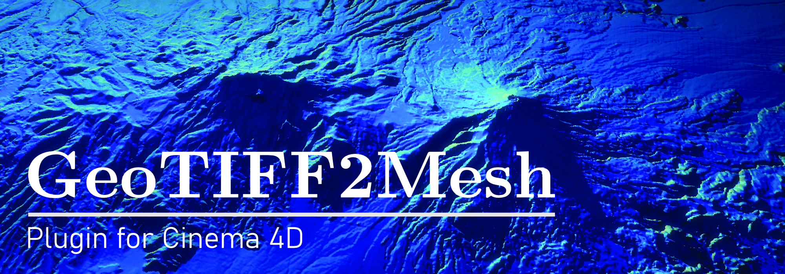
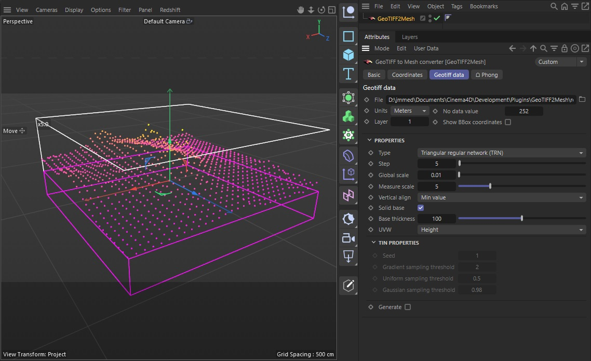
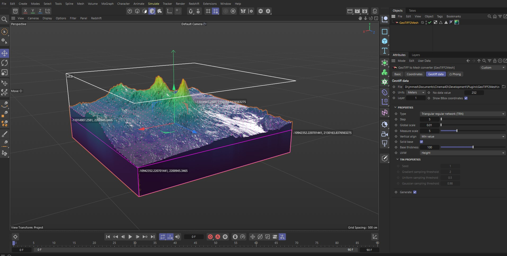
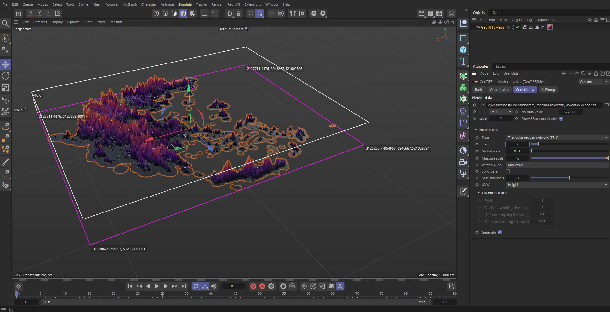

¡Welcome to the official repository of the GeoTIFF2Mesh plugin for Cinema4D!

## Description

GeoTIFF2Mesh is a Cinema 4D plugin designed to import GeoTIFF files and create 3D meshes representing terrains or landscapes. It allows users to convert geospatial data into fully editable and customizable 3D models directly within Cinema 4D.

## Requirements

-   Cinema 4D version 2024 and above (tested on Windows, pending testing on macOS and other C4D versions)
-   Python 3.x (included with Cinema 4D)
-   Python libraries: NumPy, Rasterio, and Shapely

## Installing Python Libraries

To install the necessary Python libraries, use pip. Open the command line and run the following commands:

Copy code

`
pip install numpy`
`
pip install rasterio
`
`
pip install shapely
` 

## Installation:
To install the GeoTIFF2Mesh plugin for Cinema 4D:

1.  Download the plugin or clone this repo.
2.  Unzip the downloaded archive and copy the "GeoTIFF2Mesh" folder into the Cinema 4D plugins directory, this is:
	- Windows:  `C:\Program Files\MAXON\CINEMA 4D RXX\plugins\`
	- Mac OS:  `/Applications/MAXON/CINEMA 4D RXX/plugins/`

## Parameters

**File:** Geotiff file  
**Units:** Map units, either meters or degrees  
**No Data Value:** Pixel value indicating absence of data  
**Show Box Coordinates:** Boolean value to display bounding box coordinates  

**Properties:**  
- **Type:** Type of triangulation (regular or irregular)  
- **Step:** Resampling step of the raster  
- **Global Scale:** Global scale of the terrain  
- **Measure Scale:** Measurement scale (e.g., elevation)  
- **Vertical Align:** Vertical alignment (object origin)  
- **Solid Base:** Indicates whether to create a solid surface for printing the model  
- **Base Thickness:** Thickness of the base  
- **UVW:** Texture projection map for top view or side view  

**Generate:** Boolean option indicating whether to generate the 3D object or not; recommended to keep as False until all other values are defined.

## Usage

Once installed, access GeoTIFF2Mesh from the Cinema 4D plugins menu. Configure the parameters according to your requirements, and then import and visualize your GeoTIFF terrain data as a 3D mesh directly within Cinema 4D. The generated mesh is fully editable and can be further customized using Cinema 4D's extensive modeling and rendering capabilities.

## License

GeoTIFF2Mesh is licensed under the MIT License.

## Credits

GeoTIFF2Mesh is developed by J. Miguel Medina, feel free to 